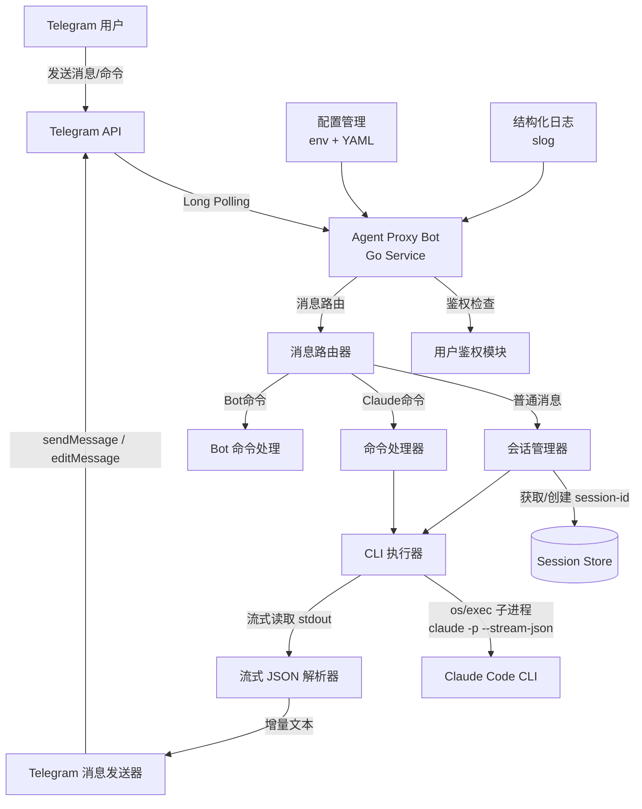

## 用户需求

在 `/Users/chenchen/CodeBuddy/agent-proxy` 目录下从零开发一个 Telegram Bot 代理项目，实现本地 Claude Code CLI 与 Telegram 的双向通信。

## 产品概述

一个基于 Go 语言的 Telegram Bot 代理服务，作为本地 Claude Code CLI 和 Telegram 之间的桥梁。用户通过 Telegram 发送消息或命令，Bot 将其转发给本地 Claude Code CLI 执行，并将 CLI 的输出实时返回到 Telegram。支持完整的 Claude Code 命令集，维护会话上下文，确保只有授权用户可以使用。

## 核心功能

1. **双向消息通信**：Telegram 消息发送到 Claude Code CLI，CLI 的响应返回到 Telegram，支持流式输出分段发送
2. **会话管理**：通过 `--session-id` 维持连续对话上下文，支持多会话切换，支持会话清理
3. **Claude Code 命令支持**：在 Telegram 中可使用 `/compact`、`/clear`、`/help`、`/model` 等所有 Claude Code 内置命令
4. **用户鉴权**：只允许配置的 Telegram 用户 ID 使用 Bot，拒绝未授权用户的请求
5. **流式输出**：Claude Code 输出可能较长，采用流式 JSON 解析并分段发送到 Telegram，避免消息截断
6. **工作目录管理**：支持通过命令切换 Claude Code 的工作目录
7. **优雅的错误处理**：CLI 超时、崩溃、网络异常等场景均有友好提示

## 技术栈

- **语言**：Go 1.22+（高性能、原生并发支持、优秀的子进程管理）
- **Telegram Bot SDK**：`github.com/go-telegram-bot-api/telegram-bot-api/v5`（最成熟的 Go Telegram Bot 库）
- **Claude Code CLI 交互**：通过 `os/exec` 包管理子进程，使用 `claude -p --output-format stream-json --session-id` 模式
- **配置管理**：环境变量 + YAML 配置文件（`github.com/spf13/viper`）
- **日志**：`log/slog`（Go 标准库结构化日志）

## 实现方案

### 整体策略

采用**子进程管理模式**：每次用户发送消息时，通过 `os/exec` 启动 `claude` CLI 子进程，使用 `--session-id` 参数维持会话上下文，使用 `--output-format stream-json` 获取流式输出。Bot 实时解析 JSON 流并将文本增量发送到 Telegram。

### 关键技术决策

1. **选择 `-p` (print) 模式而非交互模式**：`claude -p "message" --session-id xxx --output-format stream-json` 每次调用独立进程，通过 session-id 共享上下文。相比维护一个持久化交互进程，该方案更稳定、错误隔离好、不会因单次崩溃影响整个会话。

2. **流式输出处理**：Claude Code 的 `stream-json` 输出每行是一个 JSON 对象，包含 `type` 字段（如 `assistant`、`result`、`tool`）。逐行读取 stdout，解析 JSON 并将文本内容增量拼接，当累计达到一定长度或遇到完成标志时发送/更新 Telegram 消息。使用 Telegram 的 `editMessageText` API 实现消息实时更新效果。

3. **Claude Code 命令映射**：对于 `/compact`、`/clear`、`/model` 等 Claude Code 内置命令，直接将命令文本（含 `/` 前缀）作为 `-p` 参数传递给 CLI。Claude Code CLI 在 print 模式下也支持这些命令。对于 `/clear` 命令，同时清除本地 session-id 重新创建会话。

4. **Telegram 消息长度限制**：Telegram 单条消息限制 4096 字符。对于超长回复，采用分段发送策略，优先使用 editMessage 更新当前消息，超长时自动拆分为多条消息。

5. **并发安全**：使用 Go 的 goroutine 和 channel 管理并发请求。每个用户的请求串行处理（通过 per-user mutex），避免同一用户的多个请求并发执行导致 session 冲突。

### 性能与可靠性

- **子进程超时**：设置 5 分钟默认超时，防止 CLI 挂起
- **Telegram 消息更新节流**：流式输出时每 500ms 最多更新一次消息，避免 Telegram API 限流
- **优雅退出**：捕获 SIGINT/SIGTERM，正确清理子进程

## 实现注意事项

1. **stream-json 解析**：Claude Code 的流式输出每行格式为 `{"type":"assistant","message":{"content":[{"type":"text","text":"..."}]}}` 等，需正确处理不同 type（`assistant`、`tool_use`、`tool_result`、`result`）
2. **Markdown 格式兼容**：Claude Code 输出 Markdown，Telegram 支持 MarkdownV2 格式但语法略有不同（特殊字符需要转义），需要做格式转换
3. **避免 Bot Token 泄露**：Token 只通过环境变量或配置文件读取，不在日志中输出
4. **进程清理**：确保在请求取消或超时时，kill 子进程及其子进程组（使用 `cmd.Process.Kill()` 和 `syscall.Kill(-pid, syscall.SIGKILL)`）

## 系统架构



## 目录结构

```
agent-proxy/
├── go.mod                          # [NEW] Go 模块定义，模块名 github.com/agent-proxy
├── go.sum                          # [NEW] 依赖锁定文件
├── config.yaml.example             # [NEW] 配置文件示例，包含 bot_token、allowed_users、default_workdir、timeout 等配置项说明
├── main.go                         # [NEW] 程序入口。初始化配置、日志、创建 Bot 实例并启动。处理优雅退出信号
├── internal/
│   ├── config/
│   │   └── config.go               # [NEW] 配置管理模块。定义 Config 结构体（BotToken、AllowedUsers、DefaultWorkDir、Timeout、MaxMessageLength），支持从环境变量和 YAML 文件加载配置，环境变量优先级更高
│   ├── bot/
│   │   ├── bot.go                  # [NEW] Telegram Bot 核心模块。初始化 Bot API，启动 Long Polling 循环，接收 Update 并分发到 Handler。管理 Bot 生命周期
│   │   ├── handler.go              # [NEW] 消息处理器。接收 Telegram 消息，执行用户鉴权，识别消息类型（Bot 命令/Claude 命令/普通消息），路由到对应处理逻辑。实现 /start、/help（Bot帮助）、/newsession、/setdir 等 Bot 自有命令
│   │   └── sender.go              # [NEW] Telegram 消息发送器。封装 sendMessage 和 editMessageText API。实现长消息自动分段（按 4096 字符拆分）、Markdown 格式转换（转义 Telegram MarkdownV2 特殊字符）、发送节流控制（500ms 间隔）
│   ├── claude/
│   │   ├── executor.go             # [NEW] Claude CLI 执行器。核心模块，负责构建 claude 命令行参数（-p、--output-format stream-json、--session-id、--allowedTools 等），启动子进程，管理 stdin/stdout/stderr 管道，实现超时控制和进程清理
│   │   ├── stream_parser.go        # [NEW] 流式 JSON 解析器。逐行读取 claude 子进程 stdout，解析每行 JSON 对象，提取不同 type（assistant、tool_use、tool_result、result）的文本内容，通过 channel 向调用方推送增量文本
│   │   └── command.go              # [NEW] Claude Code 命令处理。定义已知的 Claude Code 命令列表（/compact、/clear、/model、/help、/doctor 等），判断用户输入是否为 Claude 命令，对 /clear 命令做特殊处理（同时重置本地 session）
│   ├── session/
│   │   └── manager.go              # [NEW] 会话管理器。为每个 Telegram 用户维护 session-id（UUID），支持创建新会话、获取当前会话、清除会话。使用 sync.Map 存储，支持设置每个会话的工作目录
│   └── middleware/
│       └── auth.go                 # [NEW] 用户鉴权中间件。检查 Telegram 用户 ID 是否在 AllowedUsers 白名单中，未授权用户返回拒绝消息
├── scripts/
│   └── build.sh                    # [NEW] 构建脚本。编译 Go 二进制文件，支持 cross-compile
└── README.md                       # [NEW] 项目文档。包含功能说明、安装配置步骤、使用方法、支持的命令列表、环境变量说明
```

## 关键数据结构

```
// internal/config/config.go
type Config struct {
    BotToken        string   `yaml:"bot_token"`
    AllowedUsers    []int64  `yaml:"allowed_users"`
    DefaultWorkDir  string   `yaml:"default_work_dir"`
    ClaudePath      string   `yaml:"claude_path"`       // claude CLI 路径，默认 "claude"
    Timeout         int      `yaml:"timeout"`            // 子进程超时秒数，默认 300
    MaxMessageLen   int      `yaml:"max_message_len"`    // Telegram 单消息最大长度，默认 4096
    UpdateInterval  int      `yaml:"update_interval_ms"` // 流式更新间隔毫秒，默认 500
}

// internal/claude/stream_parser.go - 流式 JSON 输出结构
type StreamEvent struct {
    Type    string `json:"type"`    // "assistant", "tool_use", "tool_result", "result"
    Message *struct {
        Content []ContentBlock `json:"content"`
    } `json:"message,omitempty"`
    Content []ContentBlock `json:"content,omitempty"`
    Result  string         `json:"result,omitempty"`
}

type ContentBlock struct {
    Type string `json:"type"` // "text", "tool_use", "tool_result"
    Text string `json:"text,omitempty"`
    Name string `json:"name,omitempty"`  // tool name
}

// internal/session/manager.go
type Session struct {
    ID       string // UUID
    UserID   int64  // Telegram user ID
    WorkDir  string // 工作目录
    Created  time.Time
    Mu       sync.Mutex // 串行化该会话的请求
}
```