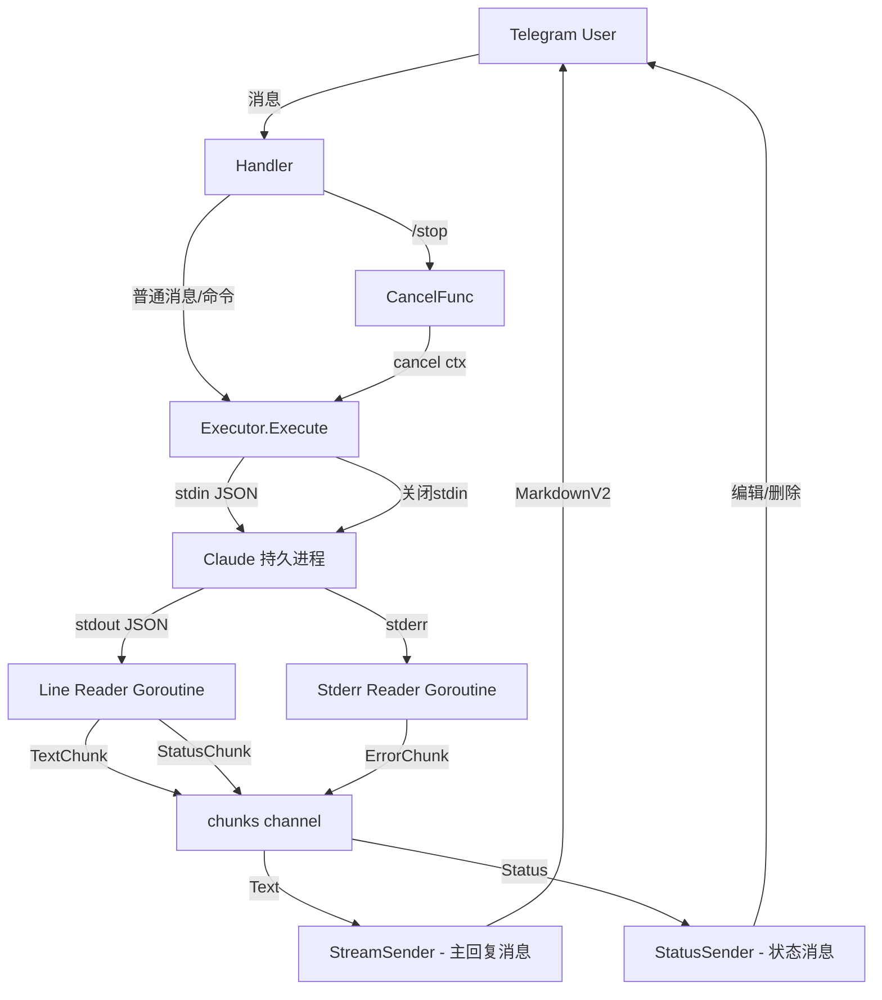

## 用户需求

用户希望通过 Telegram 对话的方式，获得与在电脑终端上使用 Claude Code 一样丝滑的交互体验。

## 产品概述

对现有 Telegram Bot 代理 Claude Code 的项目进行全面体验升级，消除当前与原生 Claude Code 交互模式之间的所有关键体验差距。

## 核心功能

1. **Markdown 渲染** — Claude 输出的代码块、粗体、列表等在 Telegram 中正确渲染，而非纯文本
2. **工具执行进度可见** — 用户能看到 Claude 正在做什么（读文件、执行命令、写文件等），以简洁状态行展示，不杂乱
3. **任务中断机制** — 用户可随时发送 /stop 取消正在执行的长任务
4. **Thinking 摘要展示** — 显示 Claude 的思考过程摘要，而非完全跳过
5. **进程健康检测与自动恢复** — Claude 持久进程异常退出时自动检测并重建
6. **stderr 捕获** — 错误信息不再丢弃，关键错误反馈给用户
7. **超时安全中断** — 修复 stdout.Scan() 阻塞导致 context 超时无法生效的问题
8. **清理死代码和未使用字段** — 移除 command.go、stream_parser.go 中未使用的函数和 sender.go 中未使用的字段

## 技术栈

- 语言: Go 1.20
- 依赖: github.com/go-telegram-bot-api/telegram-bot-api/v5, gopkg.in/yaml.v3, github.com/google/uuid
- Claude CLI: `claude -p --input-format stream-json --output-format stream-json --verbose`
- 代理: 通过 https_proxy 环境变量

## 实现方案

### 1. Markdown 渲染

当前 sender.go 中所有消息 `ParseMode = ""`，Claude 输出的 Markdown 内容在 Telegram 中无格式。改为使用 Telegram 的 MarkdownV2 模式。

核心策略：先尝试 MarkdownV2 发送，如果 Telegram API 报格式错误则自动 fallback 到纯文本发送。这样既能渲染 Claude 标准输出中的代码块和格式，又不会因为特殊字符导致发送失败。

需要实现一个 `escapeMarkdownV2` 函数，对非 Markdown 语法的特殊字符进行转义（保留 `` ` ``、`*`、`_ `等 Markdown 语法字符的格式能力，转义 `.`、`!`、`(`、`)` 等），同时对代码块内的内容不做转义。

### 2. 工具执行进度可见

当前 executor.go 中 `tool_use` 事件仅记录日志。改为向用户发送简洁的状态行：

策略：在 StreamSender 中维护一个独立的"状态消息"（与主回复消息分开），显示当前工具执行状态。当 Claude 开始使用工具时更新状态消息（如 "Reading file.go..."），当收到文本回复时删除状态消息。这样不会污染最终回复内容，又能让用户看到进度。

在 executor.go 的 `Execute` 方法中，`tool_use` 事件不再只记日志，而是通过一个新的 `StatusChunk` 类型发到 channel，handler 端区分 TextChunk 和 StatusChunk 分别处理。

### 3. 任务中断机制

添加 `/stop` 命令。实现方式：

- handler 中维护一个 per-user 的 `context.CancelFunc`
- 发起 Claude 请求时存储 cancel 函数
- 用户发送 `/stop` 时调用 cancel，触发 context.Done()
- executor.Execute 中检测到 context 取消后，向 Claude 进程发送中断信号

### 4. 修复超时不生效问题

当前 `stdout.Scan()` 是阻塞调用，`select { case <-ctx.Done(); default }` 在 Scan 之前检查，但如果 Scan 长时间阻塞则超时无法中断。

解决方案：将 stdout 读取放入独立 goroutine，通过 channel 传递行数据，主循环同时 select ctx.Done() 和 line channel。当 ctx 取消时，关闭 stdin 强制 Claude 进程结束，Scan 自然返回。

### 5. Thinking 摘要展示

当前 thinking 块完全跳过。改为：提取 thinking 文本的前 100 字符，以斜体灰色文字（MarkdownV2 的 italic 格式）作为状态提示，融入状态消息中显示。

### 6. stderr 捕获

当前 `cmd.Stderr = nil`。改为将 stderr 重定向到一个 pipe，用独立 goroutine 读取。关键错误（如进程崩溃、认证失败等）通过 channel 传递给 handler，在 Telegram 中反馈给用户。

### 7. 进程健康检测与自动恢复

在 `Execute` 方法中，如果检测到进程已死（`ps.alive == false` 或写入 stdin 失败），自动删除旧 session 并重新创建持久进程，对用户透明。当前代码已有部分逻辑，需要增强：写入失败时除了标记 dead，还要立即尝试重建并重发消息。

### 8. 清理死代码

- 删除 `internal/claude/command.go`（整个文件未使用）
- 移除 `stream_parser.go` 中的 `formatDuration`、`itoa`、`truncate` 函数和 `TextChunk.IsTool` 字段
- 移除 `sender.go` 中的 `mu sync.Map` 和 `overflow []string` 字段

## 实现注意事项

- **MarkdownV2 转义复杂度**：Telegram 的 MarkdownV2 转义规则非常严格，代码块内外转义规则不同。采用 try-send-fallback 策略最安全。
- **状态消息频率控制**：工具状态更新不能太频繁（Telegram rate limit ~30 msg/s per chat），使用去抖动策略，同一工具执行期间只更新一次状态消息。
- **进程重建的透明性**：自动重建进程时会丢失之前的对话上下文（因为新 session），应在重建后通知用户 "Session reconnected"。
- **Scan goroutine 的安全退出**：关闭 stdin 后 Claude 进程会退出，stdout pipe 关闭，Scan 返回 false，goroutine 安全退出。需要用 sync.WaitGroup 确保不泄漏。

## 架构设计



## 目录结构

```
internal/
├── bot/
│   ├── bot.go           # [MODIFY] 无变化
│   ├── handler.go       # [MODIFY] 添加 /stop 命令、per-user cancel 管理、StatusChunk 处理逻辑、状态消息管理
│   └── sender.go        # [MODIFY] 添加 MarkdownV2 支持（try-send-fallback）、SendStatus/DeleteStatus 方法、移除未使用字段
├── claude/
│   ├── executor.go      # [MODIFY] stdout 读取改为 goroutine+channel 模式、tool_use 发 StatusChunk、thinking 发 ThinkingChunk、stderr 捕获、进程自动恢复
│   ├── stream_parser.go # [MODIFY] 添加 StatusChunk/ThinkingChunk 类型、移除死代码（formatDuration/itoa/truncate/IsTool）
│   └── command.go       # [DELETE] 整个文件是死代码
├── config/config.go     # 无变化
├── middleware/auth.go   # 无变化
└── session/
    └── manager.go       # [MODIFY] 添加 per-user CancelFunc 存储和管理方法
```

## 关键代码结构

```
// stream_parser.go - 新增的 chunk 类型
type Chunk struct {
    Type     ChunkType // Text, Status, Thinking, Error
    Text     string
    ToolName string // 仅 Status 类型使用
}

type ChunkType int
const (
    ChunkText ChunkType = iota
    ChunkStatus    // 工具执行状态
    ChunkThinking  // 思考摘要
    ChunkError     // stderr 错误
)
```

```
// sender.go - MarkdownV2 安全发送
func (s *Sender) SendMarkdown(chatID int64, text string) (int, error) {
    // 尝试 MarkdownV2，失败则 fallback 纯文本
}

func (s *Sender) SendStatus(chatID int64, text string) (int, error) {
    // 发送/更新状态消息（斜体灰色）
}

func (s *Sender) DeleteMessage(chatID int64, msgID int) {
    // 删除状态消息
}
```

```
// session/manager.go - Cancel 管理
func (m *Manager) SetCancel(userID int64, cancel context.CancelFunc)
func (m *Manager) Cancel(userID int64) // 调用并清除 cancel
```

## Agent Extensions

### SubAgent

- **code-explorer**
- Purpose: 在实现各模块改动前，精确定位需要修改的函数和行号，确认现有模式
- Expected outcome: 获得每个待修改文件的精确修改点和上下文